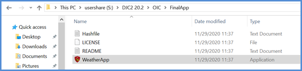
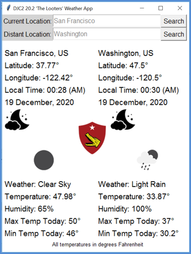
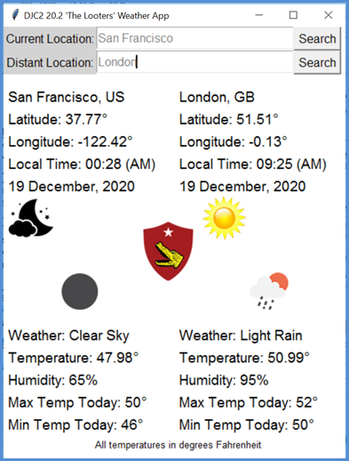
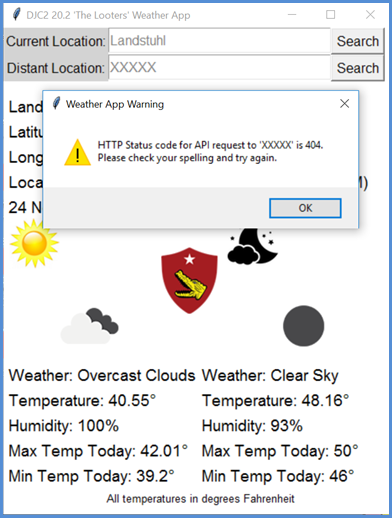

# Who are *'The Looters?'* 

A group of Marines who deployed together as part of the Deployed Joint Command & Control (DJC2) 20.2 Detachment, interested in technical development and excited by creative, unique problem solutions.

### What is *The Looter's* WeatherApp's Purpose?

This GUI application is designed to display the current weather at your location + the current weather at a second location of your choosing (such as hub/spoke satellite sites, etc.). The two locations can be anywhere across the globe, simply input the name of the nearest major city. The API data is updated approximately every 15 minutes, so a new search will be accurate to within that time period. This application could be helpful in a Command Operations Center, a Movement Coordination Center or at a Helpdesk / Service Center.

### Navigate to the Sidebar Button or project [Downloads folder](https://github.com/skipmcgee/WeatherApp/tree/main/download) to get your copy of the app:

  

  <b>Contents include the executable, hashfile, license and readme.</b>

### What is *The Looter's* WeatherApp? Check out a sneak peak:

  
   
   

### Links:
- Download the [WeatherApp](https://github.com/skipmcgee/WeatherApp/tree/main/download).
- Check out the source code and instructions if you want to roll your own WeatherApp at: [weatherscraper](https://github.com/skipmcgee/weatherscraper).
- Web page for *The Looter's* [WeatherApp project](https://skipmcgee.github.io/WeatherApp/).
- Meet [*'The Looters'*](https://skipmcgee.github.io/20.2_deployment/).
- Learn more about me at *[Skip McGee](https://skipmcgee.github.io)*.

<b>The Looter's WeatherApp project is designed, built and maintained by Skip McGee</b>

#### [<<<Back to Skip's GitHub page](https://skipmcgee.github.io)
